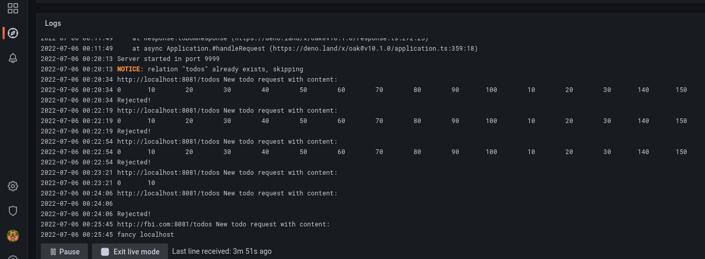

# Exercise 2.10: Project v1.3

Add logging, or actually remove unnecessarily wordy debug logging, as the required frunctionality was already there. Claened out old code left from the version without a database.



[Project source](../../Project/) now in this repo and no longer a submodule.

[Public checkout of version v0.7 here at end of part 1.](../../part1/e113/Project.v0.7/)

Latest version will be publlished one way or another before end of part 2.


Command(s) used to setup namespace, persistent volume, database and deploy the application(s):
```
sops --decrypt secret.enc.yaml | kubectl apply -f -
kubectl apply -f persistent/
kubectl apply -f manifests/
```

[The manifest folders are here.](./manifests/)


Docker images (tag: v1.2):

Back: https://hub.docker.com/r/rvlq/project/tags

Front: https://hub.docker.com/r/rvlq/proj-front/tags

Command used to start the cluster:
```
k3d cluster create --port 8082:30080@agent:0 -p 8081:80@loadbalancer --agents 2
```


logs:
[here](./e210.txt).
