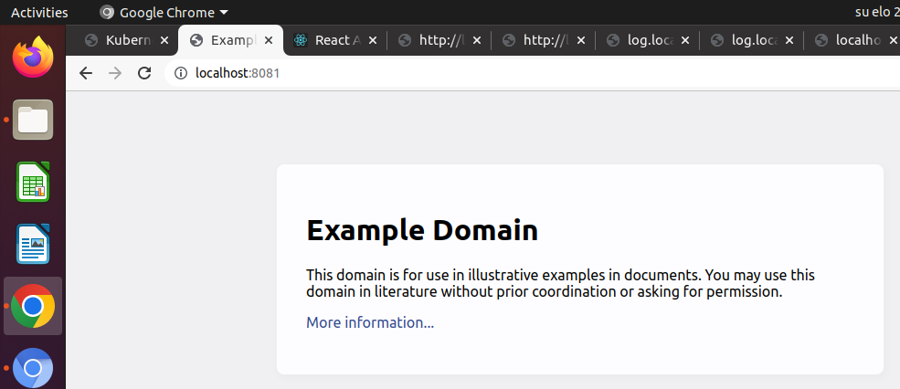
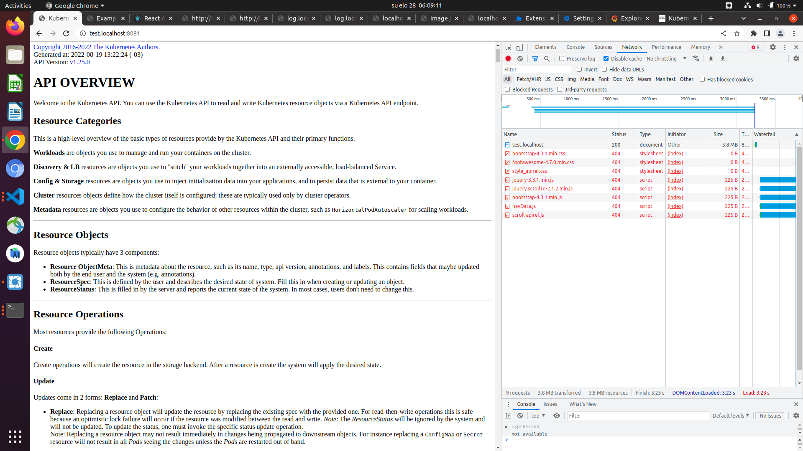

# Exercise 5.01: DIY CRD & Controller

dummysitex.yaml:
```
apiVersion: stable.dwk/v1
kind: DummySite
metadata:
  name: dummysite-gen
spec:
  website_url: https://example.com/
  # website_url: https://kubernetes.io/docs/reference/generated/kubernetes-api/v1.25/
  image: rvlq/dummy:latest
```

dummysite.yaml:
```
apiVersion: stable.dwk/v1
kind: DummySite
metadata:
  name: dummysite-gen
spec:
  # website_url: https://example.com/
  website_url: https://kubernetes.io/docs/reference/generated/kubernetes-api/v1.25/
  image: rvlq/dummy:latest
```


Web page scraping not fully implemented, as focus was on the custom controller. Works OK for `example.com`, but below css and scripts are missing.


[Possible logs](e501.txt)
