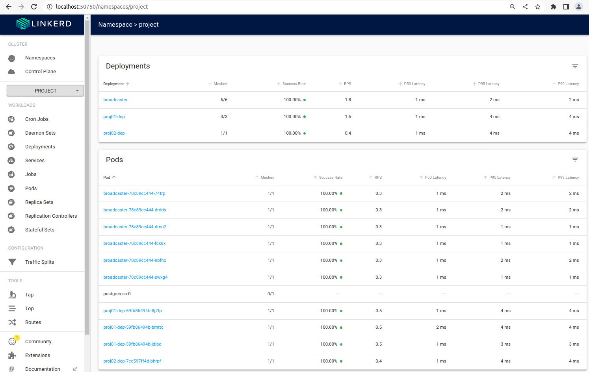

# Exercise 5.02: Project: Service Mesh Edition



The modified yamls:
```
apiVersion: apps/v1
kind: Deployment
metadata:
  name: broadcaster
  namespace: project
spec:
  replicas: 6
  selector:
    matchLabels:
      app: broadcaster
  template:
    metadata:
      annotations:
        linkerd.io/inject: enabled
      labels:
        app: broadcaster
    spec:
      containers:
      - env:
        - name: NATS_URL
          value: nats://my-nats.default:4222
        - name: TELEGRAM_KEY
          valueFrom:
            secretKeyRef:
              key: TOKEN
              name: telegram-bot-token
        image: rvlq/broadcaster@sha256:ff8f435239a458ddba34c9a8ab9d825f40a9c5671eb0ad8706000dc5325fa8be
        name: broadcaster
        resources:
          limits:
            cpu: 100m
            memory: 128Mi
---
```

```
apiVersion: apps/v1
kind: Deployment
metadata:
  name: proj02-dep
  namespace: project
spec:
  replicas: 1
  selector:
    matchLabels:
      app: proj02
  template:
    metadata:
      annotations:
        linkerd.io/inject: enabled
      labels:
        app: proj02
    spec:
      containers:
      - image: IMAGE_PLACEHOLDER
        imagePullPolicy: Always
        name: proj02
        readinessProbe:
          httpGet:
            path: /
            port: 80
          initialDelaySeconds: 5
          periodSeconds: 10
        resources:
          limits:
            cpu: 500m
            memory: 256Mi
---
```

```
apiVersion: apps/v1
kind: Deployment
metadata:
  name: proj01-dep
  namespace: project
spec:
  replicas: 3
  selector:
    matchLabels:
      app: proj01
  template:
    metadata:
      annotations:
        linkerd.io/inject: enabled
      labels:
        app: proj01
    spec:
      containers:
      - envFrom:
        - secretRef:
            name: pg-secrets
        image: IMAGE_PLACEHOLDER
        imagePullPolicy: IfNotPresent
        livenessProbe:
          failureThreshold: 5
          httpGet:
            path: /healthz
            port: 9999
          initialDelaySeconds: 20
          periodSeconds: 10
          terminationGracePeriodSeconds: 60
        name: proj01
        readinessProbe:
          httpGet:
            path: /healthz
            port: 9999
          initialDelaySeconds: 5
          periodSeconds: 10
        resources:
          limits:
            cpu: 100m
            memory: 128Mi
        volumeMounts:
        - mountPath: /app/images
          name: shared-share
      volumes:
      - name: shared-share
        persistentVolumeClaim:
          claimName: share-claim
---
```

[Possible logs](e502.txt)
